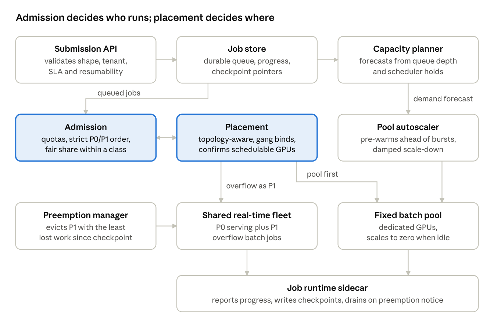

# batch-inference

Requirements and design for a scheduling and queueing layer for serverless batch inference on Kubernetes.

Batch inference is scheduled differently from request-time serving: it optimizes for throughput and cost rather than latency. The work runs on a heterogeneous GPU fleet, arrives in bursts, and is shared by many tenants with different SLAs. This project designs a **hybrid** scheduler. Jobs run in a fixed batch GPU pool sized to a baseline SLA, and overflow spills into a shared, lower-priority (P1) queue that runs on real-time serving infrastructure, behind real-time (P0) traffic.

The project is based on the blog post [Scheduling and Queueing at Scale: The Hardest Problem in Serverless Batch Inference](https://kishordaher.wordpress.com/2026/09/28/scheduling-and-queueing-at-scale-the-hardest-problem-in-serverless-batch-inference/).

## Documents

| Document | What it covers |
| --- | --- |
| [REQUIREMENTS.md](REQUIREMENTS.md) | Architecture constraints and functional and non-functional requirements. Each has an ID, a priority and an acceptance criterion, and traces back to the blog post |
| [docs/DESIGN.md](docs/DESIGN.md) | The design: components, job model, admission, placement, hybrid routing, capacity, preemption, observability, rollout and risks |

## Key design decisions

- **Admission and placement are separate.** Admission decides *who* runs now (quotas, priority, fair share). Placement decides *where* it runs (GPU topology, all-or-nothing gang binding, cost). They communicate through two calls: `CanPlace` and `Bind`.
- **Fairness lives in the scheduler.** Within each priority class, admission uses virtual-time fair queueing, so one tenant's burst can't delay another tenant's urgent job by more than 60 s.
- **Queue depth drives scaling.** A forecast based on queue depth starts pool nodes at least 5 minutes before they're needed. The scheduler and the autoscaler share one demand model, so they don't work against each other.
- **Preemption is designed in from the start.** Jobs declare whether they can resume from a checkpoint. Victims are chosen by least work lost, and a preempted job resumes from its last checkpoint rather than starting over.

## Status

Draft, v0.1. The numeric targets are provisional defaults, and the open questions are listed at the end of both documents. There is no implementation yet. The rollout plan is phased, starting with the admission/placement split.
