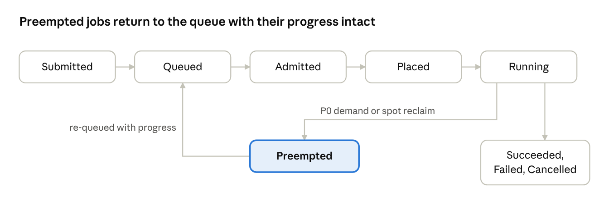
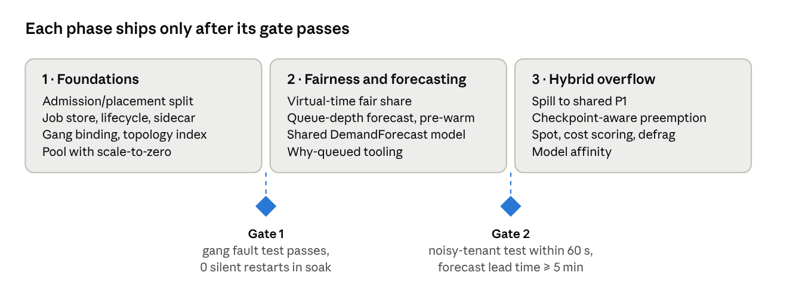

# Hybrid Batch Inference Scheduler: Design Doc

**Date:** 2026-09-28 · **Author:** Kishor Aher

**Requirements:** [`REQUIREMENTS.md`](../REQUIREMENTS.md) · **Live doc:** [Claude Docs](https://claude.ai/code/artifact/fb433273-0695-4b71-85dc-2e3ee204815e)

## Overview

We will build a batch scheduler on Kubernetes that routes jobs to a fixed GPU pool first and spills overflow into a shared P1 queue behind real-time traffic. Every requirement ID cited here (AC-, FR-, NFR-) comes from `REQUIREMENTS.md` v0.1, which is based on the post [Scheduling and Queueing at Scale](https://kishordaher.wordpress.com/2026/09/28/scheduling-and-queueing-at-scale-the-hardest-problem-in-serverless-batch-inference/).

**Goals**

- Keep admission (who may run now) and placement (where it runs) as separate services with a narrow interface between them (AC-1).
- Stop one tenant's burst from delaying another tenant's urgent job by more than 60 s (NFR-4).
- Keep placement decisions at p99 ≤ 500 ms while running 5,000 jobs with 100,000 queued (NFR-1, NFR-2).
- Never restart a preempted resumable job from zero (FR-PRE-5).
- Keep idle GPUs at ≤ 5% whenever a queued job would fit (NFR-5).

**Non-goals**

- The inference runtime, model packaging and billing, apart from emitting GPU-minute usage.
- Autoscaling real-time serving. Overflow uses the capacity the real-time autoscaler already provides (FR-CAP-7).
- Latency-optimized request serving.

## Architecture

The design splits the scheduler into stateless control services around one durable job store, and runs it beside the default Kubernetes scheduler rather than inside it (AC-3).


Admission pulls queued jobs from the store and admits a job only after placement confirms schedulable GPUs for its shape (FR-ADM-7). Placement tries the fixed pool first and falls back to the shared fleet.

| Component | Owns | Does not own | Requirements |
| --- | --- | --- | --- |
| Submission API | Spec validation, job IDs, status reads | Ordering, fairness | FR-JOB-1–5 |
| Job store | Queue, lifecycle, progress, checkpoint pointers, fair-share state | Decisions | NFR-7 |
| Admission | Quotas, priority, fair share, spill eligibility | Node selection, topology | AC-1, FR-ADM-* |
| Placement | Topology model, gang binding, cost, fragmentation | Quotas, tenant weights | AC-1, FR-PLC-* |
| Capacity planner | Queue-depth forecast, shared demand model | Node lifecycle | FR-CAP-1–3 |
| Pool autoscaler | Pool node lifecycle, pre-warm, damping | Shared fleet nodes | FR-CAP-2, 4, 5, 7 |
| Preemption manager | Victim selection, notices, spot reclaim | Admission order | FR-PRE-* |
| Job runtime sidecar | Progress reports, checkpoints, graceful drain | Scheduling | FR-JOB-6, FR-PRE-4 |

The interface between admission and placement has only two calls. `CanPlace(shape, domain) → {yes, no, reason}` is a read-only query against placement's capacity index. `Bind(job, domain) → {nodes} | rejected` performs a gang-atomic bind. Admission never sees node topology, and placement never sees quotas or tenant weights.

## Job model and lifecycle

A job declares its shape, SLA and resumability up front, and the scheduler rejects any submission that leaves the shape out (FR-JOB-1 to FR-JOB-3).

```yaml
apiVersion: batch.inference/v1
kind: InferenceJob
metadata: {tenant: acme, jobClass: nightly-embeddings}
spec:
  sla: standard            # urgent | standard | best-effort
  shape:
    gpuTypes: [H100, A100] # acceptable set, cheapest first
    gpuCount: 4
    interconnect: nvlink   # same NVLink domain required
    cpu: 32
    memoryGi: 256
  model: llama-70b-instruct # affinity hint (FR-PLC-5)
  resumability:
    checkpoints: true
    intervalSeconds: 300
    store: s3://ckpt/acme/
  spill: afterQueued 120s  # never | afterQueued <d> | immediate
```



A job can be cancelled from any state that isn't terminal. Every transition is timestamped in the job store (FR-JOB-5).

**Resumability contract** (FR-JOB-6, FR-PRE-4 to FR-PRE-7)

- Every 30 s, the sidecar reports `progress = {done, total}` and the URI of the latest valid checkpoint.
- A checkpoint counts as valid only after it is fully written and its manifest is committed. The pointer moves only after that commit.
- Work is split into ranges keyed by `(jobId, rangeId)`, and each range's output is written with an idempotent key. A replay therefore overwrites output instead of duplicating it.
- On a preemption notice, the sidecar gets a grace period of up to 20 s to checkpoint. The rest of FR-PRE-1's 30 s budget goes to eviction.
- A job that declares `checkpoints: false` counts as non-resumable. By default it doesn't spill (FR-HYB-4), and it is always the last choice of preemption victim.

## Admission

Admission runs one cycle per second. Each cycle has three stages: a strict priority order, then a quota filter, then start-time fair queueing among the tenants inside each class (FR-ADM-1 to FR-ADM-3).

**Order of evaluation, per cycle**

1. **Priority classes, strictly ordered:** pool-urgent, then pool-standard, then P1-urgent, then P1-standard, then P1-best-effort. A lower class is only looked at once every higher class has nothing it can place (FR-ADM-2, FR-ADM-4).
2. **Quota filter.** A tenant already at its concurrent-GPU or GPU-minute quota stays in `Queued` and is skipped. It is never rejected (FR-ADM-1).
3. **Fair share inside a class.** Each tenant has one FIFO queue per class. The next job comes from the tenant with the smallest virtual start tag.
4. **Placement check.** Admission calls `CanPlace`. On a `no`, it moves to the next tenant rather than blocking the class, so one unplaceable 8-GPU job can't cause head-of-line blocking (FR-ADM-7).

**Virtual-time fair share.** A job's cost is its GPU count times its estimated runtime in minutes, divided by the tenant's weight w. Each tenant i keeps a finish tag F, and every job gets a start tag S:

```math
S_j = \max(V, F_i), \quad F_i \leftarrow S_j + \frac{\text{gpus}_j \times \text{est\_minutes}_j}{w_i}
```

V is the class's virtual clock, which advances to the smallest start tag among backlogged tenants. A tenant with 10,000 queued jobs only pushes its own tags forward. A tenant that submits 5 urgent jobs arrives at tag V and is served next. This is the behaviour the FR-ADM-3 test checks against NFR-4's 60 s bound.

**Design choices**

- Runtime estimates come from the job class's p50 runtime, re-estimated daily. A job that runs past its estimate is charged for the extra time when it finishes, so under-estimating gains nothing.
- Fair-share state for pool and overflow is stored in one place in the job store, so spilling doesn't earn extra share (FR-HYB-5).
- A re-queued preempted job keeps its original start tag and is charged only for the work that's left (FR-PRE-7).
- Weights and quotas are hot-reloaded from a ConfigMap on the next cycle (FR-ADM-5, NFR-10).
- The API gateway may rate-limit abusive clients, but it plays no part in fairness (FR-ADM-6).

## Placement

Placement keeps an in-memory index of the fleet's GPU topology. It binds each job's GPUs all at once or not at all, and it scores candidate nodes on topology fit, fragmentation, cost and model affinity, in that order of weight (FR-PLC-1 to FR-PLC-7).

**Topology model.** The index is a tree: node, then NUMA socket, then NVLink/NVSwitch domain, then GPU. It is built from device-plugin and node-feature labels and refreshed from watch events. For each common shape (1, 2, 4 and 8 GPUs of each type), the index keeps a count of *schedulable* slots, meaning free GPUs that sit together in one interconnect domain. Admission's `CanPlace` answers straight from these counts, and they also drive the free-vs-schedulable gauge (FR-PLC-3, FR-OBS-3).

**Gang binding** (FR-PLC-2)

1. Reserve every GPU the job needs in the index, with a 5 s TTL.
2. Create all of the job's pods with the batch `schedulerName`, pinned to the reserved nodes.
3. Commit through the Kubernetes Binding API. If any bind fails, release every reservation and return the job to admission.

A job never holds some of its GPUs while waiting for the rest. The fault-injection test kills placement between steps 2 and 3 and checks that no reservation is still held after the TTL.

**Scoring.** Every candidate node set that fits the shape and interconnect constraint gets a score, and the highest score wins:

| Term | Weight | Rewards | Requirement |
| --- | --- | --- | --- |
| Topology fit | 0.40 | All GPUs in one NVLink domain and on one NUMA socket | FR-PLC-1 |
| Fragmentation | 0.30 | Best fit: fills nodes that are already partly used and keeps whole nodes free for 8-GPU shapes | FR-PLC-4, NFR-6 |
| Cost | 0.20 | The cheapest acceptable GPU type per GPU-minute | FR-PLC-6 |
| Affinity | 0.10 | Nodes that already have the model's weights cached | FR-PLC-5 |

**Reducing fragmentation.** The first defence is best-fit scoring. As a second step, when the fragmentation ratio for the 8-GPU shape stays above 20% for 10 minutes while 8-GPU jobs are queued, placement asks the preemption manager to migrate resumable 1-GPU and 2-GPU jobs off the node that is closest to being fully free. A migration is a checkpoint followed by a re-queue, so it reuses the preemption path.

**Latency.** Scoring runs over a shortlist of at most 50 nodes, filtered from the index by shape and GPU type. That keeps the p99 decision time within NFR-2's 500 ms at 5,000 running jobs. The index is sharded by GPU type if one shard's p99 goes above 250 ms.

## Hybrid routing

Every admitted job tries the fixed pool first. It spills to the shared fleet as P1 only when its spill policy allows it and the job is safe to preempt (FR-HYB-1 to FR-HYB-4).

**Routing rules, first match wins**

1. The class is `pool-only`. The job waits for the pool and is never placed on shared nodes (FR-HYB-3).
2. `CanPlace(shape, pool)` returns yes. The job binds in the pool.
3. The job isn't eligible to spill: it is non-resumable and its estimated runtime is over 10 minutes. It waits for the pool, unless its policy explicitly overrides this (FR-HYB-4).
4. The spill policy is `immediate`, or `afterQueued d` and d has passed. The job goes to the P1 queue on the shared fleet.
5. None of the above matched. The job waits, and its queued demand counts toward the pool's scale-up forecast.

| Policy | Default for | Behaviour |
| --- | --- | --- |
| `never` | Classes with contractual SLAs | Pool only. The same as `pool-only`, but set per job |
| `afterQueued 120s` | Standard batch | Spills once the job has waited 2 minutes, which is shorter than the 5-minute pre-warm lead time |
| `immediate` | Best-effort and backfill | Goes to P1 as soon as the pool can't place it |

**What overflow doesn't do.** P1 never triggers node scale-up on the shared fleet. It only uses capacity that the real-time autoscaler has already provisioned (FR-CAP-7). A spilled job that is preempted goes back to step 2, so it returns to the pool if the pool has room by then.

## Capacity

The capacity planner publishes one demand forecast for each GPU type. The pool autoscaler acts only on that forecast, never on pending pods. This lets it start nodes at least 5 minutes before a burst is dequeued, and it keeps the scheduler and autoscaler from working against each other (FR-CAP-1 to FR-CAP-3).

**Forecast.** Every 30 s, the planner reads the queue depth in GPUs for each type and class, plus any jobs admission is holding for quota. It computes:

```math
D_{t+h} = \text{running}_t + \text{queued}_t + h \times \text{EWMA}(\text{arrival rate} - \text{completion rate})
```

The horizon h is 10 minutes, twice the 5-minute node lead time, and the EWMA half-life is 5 minutes. Jobs held for quota are subtracted, so nodes aren't started for work that admission has decided to wait on. Known schedules such as nightly exports can be added as calendar bumps later (Open Question 7).

**Shared demand model.** The forecast is written to a `DemandForecast` custom resource, and admission and the autoscaler both read it. The autoscaler's rule is simple: target nodes = ceil(D / GPUs per node), and the result is clamped between the warm floor and the pool maximum. The cluster autoscaler's pending-pod trigger is turned off for pool node groups, so this rule is the only thing that scales the pool.

| Control | Default | Requirement |
| --- | --- | --- |
| Pre-warm lead time | ≥ 5 min | FR-CAP-2 |
| Scale-down blackout before a forecast burst | 15 min | FR-CAP-3 |
| Scale-down cool-down | Node idle for 10 min, then at most 25% of idle nodes per step | FR-CAP-5 |
| Maximum scale events | 6 per hour per node group | FR-CAP-5 |
| Warm floor | 0 by default, configurable per GPU type and class | FR-CAP-4 |

**Detecting cold-start amplification** (FR-CAP-6). An alert fires when more than 20% of the pool's target nodes are still provisioning and queue depth rose over the previous 5 minutes. The alert means the forecast lagged the burst, and it links to the forecast-error panel.

## Preemption and resumability

The preemption manager picks victims by the least work lost since their last checkpoint. It reads each candidate's progress before it decides, and every eviction finishes within 30 s: up to 20 s for the job to checkpoint, then the eviction itself (FR-PRE-1 to FR-PRE-3).

**Triggers**

- P0 pressure on the shared fleet. The real-time serving layer marks capacity it needs, or P0 pods are left pending.
- A spot reclaim notice for any node, in the pool or the shared fleet. This goes through the same path (FR-PRE-8).
- A defragmentation request from placement (see Placement).

**Victim selection.** Among the P1 jobs whose freed GPUs would satisfy the demand, the manager ranks by:

```math
\text{cost}_j = \text{gpus}_j \times \text{minutes since checkpoint}_j \times \text{class weight}_j \times (1 + \text{preemptions}_j)
```

It evicts the cheapest set that frees enough capacity. A non-resumable job loses its whole elapsed runtime when evicted, so that elapsed time counts as its minutes since checkpoint. As a result, it is evicted last. The `(1 + preemptions)` factor steers repeated evictions away from the same job. After 3 preemptions, a job is pinned to the pool (FR-PRE-9).

**Eviction sequence**

1. Mark the job `Preempting` in the job store, recording the progress and checkpoint pointer that the decision was based on (FR-PRE-2).
2. Send the sidecar a notice with a 20 s deadline. The sidecar finishes or abandons its current range and commits a checkpoint (FR-PRE-4).
3. Evict the pods, or let the spot reclaim take the node.
4. Re-queue the job with its latest committed checkpoint and its original fair-share start tag. On resume, it restarts from that checkpoint (FR-PRE-5, FR-PRE-7).

**Proof of no silent restarts.** Every resume records `resumedFrom`. If a job resumes with `resumedFrom = 0` while an earlier checkpoint exists, that counts as a defect. It increments `silent_restarts_total`, which should always be 0, and pages on-call (FR-OBS-4). Because range outputs are idempotent (see Job model and lifecycle), a replayed range can never produce duplicate output (FR-PRE-6).

## Observability, reliability and scale

The job store is the one durable dependency. The control services are leader-elected and rebuild their in-memory state from the store within 30 s of a failover, so no admitted or queued job is lost (NFR-7, NFR-8).

**Reliability**

- **Job store.** Postgres with synchronous replication. Queue, lifecycle, progress, checkpoint pointers and fair-share tags all live in it, and each state transition is a single transaction.
- **Control services.** Admission, placement, the planner and the preemption manager each run 2 replicas with Kubernetes lease-based leader election. The standby follows the store and takes over when the lease expires, after 15 s. It then spends 15 s or less rebuilding the topology index from node watches.
- **Outstanding reservations.** A leader that fails can leave reservations behind. They expire through the 5 s TTL, so a failover never strands GPUs.
- **P0 isolation** (NFR-9). P1 pods run in a lower `PriorityClass` with `preemptionPolicy: Never`. The kubelet and the real-time scheduler can always evict them, even if the preemption manager is down.

**Metrics and alerts**

| Signal | Alert when | Requirement |
| --- | --- | --- |
| Queue wait p50/p95/p99 by tenant and class | An urgent job waits more than 60 s due to another tenant | FR-OBS-1, NFR-4 |
| Placement decision latency | p99 over 500 ms for 5 min | FR-OBS-2, NFR-2 |
| Free vs schedulable GPUs by shape | 8-GPU fragmentation over 20% for 10 min | FR-OBS-3, NFR-6 |
| Idle GPUs with a fitting job queued | Over 5% for 15 min | NFR-5 |
| Preemptions, lost GPU-minutes, silent restarts | Any silent restart | FR-OBS-4 |
| Cold starts, pre-warm hit rate, forecast error | Cold-start amplification (see Capacity) | FR-OBS-5, FR-CAP-6 |
| Scheduler/autoscaler disagreements | More than 3 per hour | FR-OBS-6 |
| Pool vs overflow utilization, spill rate | Dashboard only | FR-OBS-7 |
| GPU-minutes per tenant and job | Drift from node usage over 1% | FR-OBS-8 |

`kubectl batch why <job>` prints the admission or placement stage that is holding a job, and why: over quota, fair-share position, no schedulable shape, or reservation pending (FR-OBS-9).

**Scale plan** (NFR-1, NFR-3). The load test replays 5,000 running jobs, 100,000 queued jobs and 500 tenants on a simulated fleet using kwok nodes. It then drives a 10× burst of arrivals. It passes when queue wait grows in proportion to the capacity shortfall, placement p99 stays at 500 ms or less, and no component restarts.

## Rollout, alternatives and risks

We ship in three phases, in the order the requirements set (§8 of REQUIREMENTS.md). A phase starts only once the previous gate passes *and* measured load calls for it: tenant count, job volume, or the failure modes we actually observe.



The admission/placement split comes first because it is the hardest thing to retrofit onto a live platform (AC-4).

**Alternatives considered**

| Option | Why not, or not yet |
| --- | --- |
| Default Kubernetes scheduler only | No gang binding, no fair share, no GPU-minute cost model. Fails AC-3 |
| Kueue or Volcano as the whole scheduler | Strong on quotas and gang admission. Needs a spike to check topology-aware placement and FR-ADM-3's 60 s bound. It may still become our admission layer |
| Fixed pool only | Pays for idle GPUs between bursts, or waits on scale-up. Ignores the idle real-time capacity available at night |
| Shared P1 queue only | No throughput guarantee for batch SLAs. Every job is exposed to preemption |

**Risks**

| Risk | Mitigation |
| --- | --- |
| Runtime estimates are wrong, which skews fair share | Charge the true runtime when a job finishes. Re-estimate per class every day |
| Runtimes don't honour the checkpoint contract | The sidecar enforces it. Jobs that don't comply are treated as non-resumable and pool-only |
| Scoring pushes placement latency past 500 ms | Shortlist of 50 nodes, index sharded by GPU type, latency alert |
| The forecast lags sudden bursts | Warm floor for urgent classes. Calendar bumps for known schedules |
| The hybrid inherits both architectures' failure modes | Every one is mapped to a requirement and a test (§7 of REQUIREMENTS.md) |

**Open questions**

- [ ] Build admission ourselves, or adopt Kueue after the Phase 1 spike?
- [ ] What share of the fleet will be spot? This decides how urgent FR-PRE-8 is.
- [ ] What checkpoint format and storage backend will we agree with the runtime teams?
- [ ] How does the baseline SLA translate into the pool's initial size for each GPU type?
- [ ] Is a moving-average forecast enough, or do known schedules need to feed it directly?
